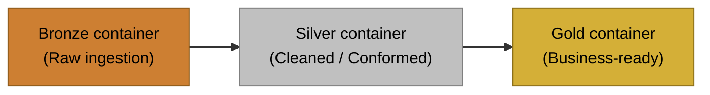

# Azure AdventureWorks Data Engineering (IaC)

Terraform-first infrastructure for an AdventureWorks data engineering project on Azure.



## Quick Start
1) Install prerequisites:
   - Azure CLI (az)
   - Terraform (>= 1.5)
   - Python 3.10+

2) Authenticate to Azure:
```powershell
az login
az account show
```

3) Deploy infrastructure:
```powershell
python scripts\deploy.py
```

## Resource Naming
Resources use a prefix plus a random pet suffix for uniqueness, for example:
`rg-adventureworks-cool-otter`
Set `resource_group_name` in `terraform/01_resource_group/terraform.tfvars` (or edit defaults in `scripts/deploy.py`) to override.

## Project Structure
- `terraform/01_resource_group`: Azure resource group
- `terraform/02_storage_account`: ADLS Gen2 storage account + medallion containers
- `terraform/03_data_factory`: Azure Data Factory v2
- `terraform/04_adf_linked_services`: ADF linked services (HTTP source via azapi + ADLS Gen2 sink; AutoResolve IR)
- `scripts/`: Deploy/destroy helpers (auto-writes terraform.tfvars)
- `guides/setup.md`: Detailed setup guide
- `notebooks/`: Databricks notebooks (to be added)

Example variables files:
- `terraform/01_resource_group/terraform.tfvars.example`
- `terraform/02_storage_account/terraform.tfvars.example`
- `terraform/03_data_factory/terraform.tfvars.example`
- `terraform/04_adf_linked_services/terraform.tfvars.example`

## Deploy/Destroy Options
Deploy:
```powershell
python scripts\deploy.py
python scripts\deploy.py --rg-only
python scripts\deploy.py --storage-only
python scripts\deploy.py --datafactory-only
python scripts\deploy.py --adf-links-only
```

Destroy:
```powershell
python scripts\destroy.py
python scripts\destroy.py --rg-only
python scripts\destroy.py --storage-only
python scripts\destroy.py --datafactory-only
python scripts\destroy.py --adf-links-only
```

## Guide
See `guides/setup.md` for detailed instructions.
