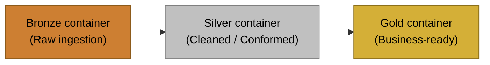

# Azure AdventureWorks Data Engineering (IaC)

Terraform-first infrastructure for an AdventureWorks data engineering project on Azure.



## Quick Start
1) Install prerequisites:
   - Azure CLI (az)
   - Terraform (>= 1.5)
   - Python 3.10+
   - sqlcmd (mssql-tools18) for serverless SQL bootstrap

2) Authenticate to Azure:
```powershell
az login
az account show
```

3) Deploy infrastructure:
```powershell
python scripts\deploy.py
```
This runs Terraform, executes the serverless SQL bootstrap script, and publishes manual SQL scripts to Synapse Studio.
If you prefer, place `DATABRICKS_TOKEN` in a gitignored `.env` file at the repo root; the scripts will load it automatically.
For ADLS OAuth in the Databricks cluster, you can also set `ADLS_OAUTH_CLIENT_ID`, `ADLS_OAUTH_CLIENT_SECRET`, `ADLS_OAUTH_TENANT_ID`, and `ADLS_STORAGE_ACCOUNT_NAME` in `.env`, or let the `09_databricks_adls_sp` module generate them.

## Databricks Notebook Access
The Databricks cluster exports `STORAGE_ACCOUNT_NAME`, so notebooks can build `abfss://` paths without hardcoding.

```python
import os

storage_account = os.getenv("STORAGE_ACCOUNT_NAME")
bronze_root = f"abfss://bronze@{storage_account}.dfs.core.windows.net/"
display(dbutils.fs.ls(bronze_root))
```

If you recreate the storage account, redeploy the cluster so the env var is refreshed.
Notebook uploads are managed by `terraform/10_databricks_notebooks` and target `/Users/<token-user-email>`.

## Resource Naming
Resources use a prefix plus a random pet suffix for uniqueness, for example:
`rg-adventureworks-cool-otter`
Set `resource_group_name` in `terraform/01_resource_group/terraform.tfvars` (or edit defaults in `scripts/deploy.py`) to override.

## Project Structure
- `terraform/01_resource_group`: Azure resource group
- `terraform/02_storage_account`: ADLS Gen2 storage account + medallion containers
- `terraform/03_data_factory`: Azure Data Factory v2
- `terraform/04_adf_linked_services`: ADF linked services (HTTP source via azapi + ADLS Gen2 sink)
- `terraform/05_adf_pipeline_http`: ADF pipeline + datasets (lookup -> foreach -> copy)
- `terraform/06_databricks`: Azure Databricks workspace (Premium)
- `terraform/07_databricks_cluster`: Databricks cluster (single-node, Photon)
- `terraform/08_databricks_access_connector`: Databricks access connector + storage RBAC
- `terraform/09_databricks_adls_sp`: ADLS OAuth service principal + container RBAC
- `terraform/10_databricks_notebooks`: Databricks notebooks (user home upload)
- `terraform/11_synapse_analytics`: Synapse workspace + dedicated ADLS Gen2 storage
- `scripts/`: Deploy/destroy helpers (auto-writes terraform.tfvars)
- `sql/serverless`: Serverless SQL scripts (bootstrap + manual publish)
- `guides/setup.md`: Detailed setup guide
- `notebooks/`: Databricks notebooks

Example variables files:
- `terraform/01_resource_group/terraform.tfvars.example`
- `terraform/02_storage_account/terraform.tfvars.example`
- `terraform/03_data_factory/terraform.tfvars.example`
- `terraform/04_adf_linked_services/terraform.tfvars.example`
- `terraform/05_adf_pipeline_http/terraform.tfvars.example`
- `terraform/06_databricks/terraform.tfvars.example`
- `terraform/07_databricks_cluster/terraform.tfvars.example`
- `terraform/08_databricks_access_connector/terraform.tfvars.example`
- `terraform/09_databricks_adls_sp/terraform.tfvars.example`
- `terraform/10_databricks_notebooks/terraform.tfvars.example`
- `terraform/11_synapse_analytics/terraform.tfvars.example`

## Deploy/Destroy Options
Deploy:
```powershell
python scripts\deploy.py
python scripts\deploy.py --rg-only
python scripts\deploy.py --storage-only
python scripts\deploy.py --datafactory-only
python scripts\deploy.py --adf-links-only
python scripts\deploy.py --adf-pipeline-only
python scripts\deploy.py --databricks-only
python scripts\deploy.py --databricks-access-only
python scripts\deploy.py --databricks-adls-sp-only
python scripts\deploy.py --databricks-cluster-only
python scripts\deploy.py --databricks-notebooks-only
python scripts\deploy.py --synapse-only
python scripts\deploy.py --sql
python scripts\deploy.py --sql-only
python scripts\deploy.py --publish-sql
python scripts\deploy.py --publish-sql-only
```

Destroy:
```powershell
python scripts\destroy.py
python scripts\destroy.py --rg-only
python scripts\destroy.py --storage-only
python scripts\destroy.py --datafactory-only
python scripts\destroy.py --adf-links-only
python scripts\destroy.py --adf-pipeline-only
python scripts\destroy.py --databricks-only
python scripts\destroy.py --databricks-access-only
python scripts\destroy.py --databricks-adls-sp-only
python scripts\destroy.py --databricks-cluster-only
python scripts\destroy.py --databricks-notebooks-only
python scripts\destroy.py --synapse-only
```

ADLS OAuth: when `09_databricks_adls_sp` is deployed (or `ADLS_OAUTH_*` env vars are set), the cluster is configured for direct `abfss://` access using OAuth and exposes `STORAGE_ACCOUNT_NAME`. Notebook uploads go to the current user's workspace path from the Databricks token.
Storage RBAC: the deploy script grants Storage Blob Data Contributor on the primary storage account to the signed-in user (override with `STORAGE_BLOB_CONTRIBUTOR_OBJECT_ID`). Synapse's managed identity is also granted Storage Blob Data Contributor on both the Synapse workspace storage and the primary ADLS account.
Synapse: set `SYNAPSE_AAD_ADMIN_LOGIN` (group recommended). If nothing is provided, the deploy script attempts to use the signed-in Azure CLI user; if directory reads are restricted, set `SYNAPSE_AAD_ADMIN_OBJECT_ID` or `aad_admin_object_id` in `terraform/11_synapse_analytics/terraform.tfvars`. The deploy script generates a SQL admin password if missing (per-user) and you can override with `SYNAPSE_SQL_ADMIN_PASSWORD`. Optionally set `SYNAPSE_SQL_ADMIN_LOGIN` and `SYNAPSE_FILESYSTEM_NAME` to override defaults.
Synapse firewall: the Synapse module auto-creates a firewall rule for your current public IP. If your IP changes, re-run the Synapse deploy.
Serverless SQL bootstrap: a single script in `sql/serverless/00_create_db.sql` runs via `sqlcmd` during a full deploy, or when you pass `--synapse-only --sql` or `--sql-only`. It uses `--authentication-method ActiveDirectoryAzCli`, so ensure `az login` is active.
Synapse SQL publish: scripts in `sql/serverless/manual` are published to the workspace (Develop -> SQL scripts) during a full deploy, or when you pass `--synapse-only --publish-sql` or `--publish-sql-only`. The publisher substitutes `$(STORAGE_ACCOUNT_NAME)` using the storage account name from Terraform outputs.


## Guide
See `guides/setup.md` for detailed instructions.
