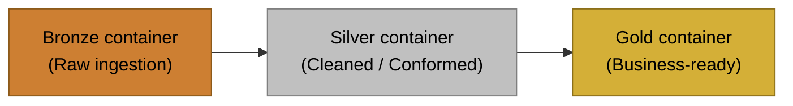

# Project Setup Guide

This project provisions Azure resources using Terraform and includes helper scripts.



## Prerequisites
- Azure CLI (az) installed and authenticated
- Terraform installed (>= 1.5)
- Python 3.10+ (for running the helper scripts)
- sqlcmd (mssql-tools18) for serverless SQL bootstrap
- Entra ID permissions to create app registrations if you use `09_databricks_adls_sp`

## Azure CLI
Check your Azure CLI and login status:

```powershell
az --version
az login
az account show
```

If you need to switch subscriptions:

```powershell
az account list --output table
az account set --subscription "<subscription-id-or-name>"
az account show
```

## Terraform Setup
Check if Terraform is installed and on PATH:

```powershell
terraform version
```

Install or update Terraform on Windows:

```powershell
winget install HashiCorp.Terraform
```

```powershell
choco install terraform -y
```

After installing, re-open PowerShell and re-run terraform version.

## Project Structure
- `terraform/01_resource_group`: Azure resource group
- `terraform/02_storage_account`: ADLS Gen2 storage account + medallion containers
- `terraform/03_data_factory`: Azure Data Factory v2
- `terraform/04_adf_linked_services`: ADF linked services (HTTP source + ADLS Gen2 sink)
- `terraform/05_adf_pipeline_http`: ADF pipeline + datasets (lookup -> foreach -> copy)
- `terraform/06_databricks`: Azure Databricks workspace (Premium)
- `terraform/07_databricks_cluster`: Databricks cluster (single-node, Photon)
- `terraform/08_databricks_access_connector`: Databricks access connector + storage RBAC
- `terraform/09_databricks_adls_sp`: ADLS OAuth service principal + container RBAC
- `terraform/10_databricks_notebooks`: Databricks notebooks (user home upload)
- `terraform/11_synapse_analytics`: Synapse workspace + dedicated ADLS Gen2 storage
- `scripts/`: Helper scripts to deploy/destroy Terraform resources
- `sql/serverless`: Serverless SQL scripts (bootstrap + manual publish)
- `guides/setup.md`: This guide
- `notebooks/`: Databricks notebooks

## Architecture Overview
```mermaid
flowchart LR
    RG[Resource group] --> SA[ADLS Gen2 (project storage)]
    SA --> B[bronze]
    SA --> S[silver]
    SA --> G[gold]
    RG --> ADF[Data Factory]
    RG --> DBX[Databricks]
    RG --> SYN[Synapse workspace]
    ADF --> SA
    DBX --> SA
    SYN --> SA
    SYN --> SQL[Serverless SQL + Studio scripts]
```

## Configure Terraform
The deploy script writes `terraform/01_resource_group/terraform.tfvars` and `terraform/02_storage_account/terraform.tfvars` automatically.
If you want different defaults, edit `DEFAULTS` in `scripts/deploy.py` before running.

Example variables files:
- `terraform/01_resource_group/terraform.tfvars.example`
- `terraform/02_storage_account/terraform.tfvars.example`
- `terraform/03_data_factory/terraform.tfvars.example`
- `terraform/04_adf_linked_services/terraform.tfvars.example`
- `terraform/05_adf_pipeline_http/terraform.tfvars.example`
- `terraform/06_databricks/terraform.tfvars.example`
- `terraform/07_databricks_cluster/terraform.tfvars.example`
- `terraform/08_databricks_access_connector/terraform.tfvars.example`
- `terraform/09_databricks_adls_sp/terraform.tfvars.example`
- `terraform/10_databricks_notebooks/terraform.tfvars.example`
- `terraform/11_synapse_analytics/terraform.tfvars.example`

## Resource Naming
Resource names are built from a prefix plus a random pet suffix.
Override them by setting the explicit name variables or changing the prefixes.

## Deploy Resources
From the repo root or scripts folder, run:

```powershell
python scripts\deploy.py
```
This runs Terraform, executes the serverless SQL bootstrap script, and publishes manual SQL scripts to Synapse Studio.

Optional flags:

```powershell
python scripts\deploy.py --rg-only
python scripts\deploy.py --storage-only
python scripts\deploy.py --datafactory-only
python scripts\deploy.py --adf-links-only
python scripts\deploy.py --adf-pipeline-only
python scripts\deploy.py --databricks-only
python scripts\deploy.py --databricks-access-only
python scripts\deploy.py --databricks-adls-sp-only
python scripts\deploy.py --databricks-cluster-only
python scripts\deploy.py --databricks-notebooks-only
python scripts\deploy.py --synapse-only
python scripts\deploy.py --sql
python scripts\deploy.py --sql-only
python scripts\deploy.py --publish-sql
python scripts\deploy.py --publish-sql-only
```
Note: `--publish-sql` is additive; if you pass it by itself, it runs the full deploy and then publishes scripts. Use `--publish-sql-only` or `--synapse-only --publish-sql` to publish without the full pipeline.
Note: `--sql` is also additive; if you pass it by itself, it runs the full deploy and then runs the SQL bootstrap. Use `--sql-only` or `--synapse-only --sql` to run SQL without the full pipeline.

## Databricks Notebook Access
The Databricks cluster exports `STORAGE_ACCOUNT_NAME`, so notebooks can build `abfss://` paths without hardcoding.

```python
import os

storage_account = os.getenv("STORAGE_ACCOUNT_NAME")
bronze_root = f"abfss://bronze@{storage_account}.dfs.core.windows.net/"
display(dbutils.fs.ls(bronze_root))
```

If you recreate the storage account, redeploy the cluster so the env var is refreshed.
Notebook uploads are managed by `terraform/10_databricks_notebooks` and target `/Users/<token-user-email>`.

## Destroy Resources
To tear down resources:

```powershell
python scripts\destroy.py
```

Optional flags:

```powershell
python scripts\destroy.py --rg-only
python scripts\destroy.py --storage-only
python scripts\destroy.py --datafactory-only
python scripts\destroy.py --adf-links-only
python scripts\destroy.py --adf-pipeline-only
python scripts\destroy.py --databricks-only
python scripts\destroy.py --databricks-access-only
python scripts\destroy.py --databricks-adls-sp-only
python scripts\destroy.py --databricks-cluster-only
python scripts\destroy.py --databricks-notebooks-only
python scripts\destroy.py --synapse-only
```

## Notes
- If you run Terraform directly in a module (not via the scripts), run `terraform init` first to create/update the provider lock file.
- Storage defaults to Standard performance, LRS, ADLS Gen2 (HNS enabled), and public network access.
- Data Factory is provisioned as v2 with a random pet suffix by default.
- Linked services include an HTTP source (anonymous; certificate validation enabled via azapi) and ADLS Gen2 sink (account key). The HTTP linked service uses the default AutoResolveIntegrationRuntime.
- The pipeline reads `parameters/parameters.json` from the `parameters` container and copies each HTTP file into the `bronze` container.
- Databricks is provisioned on the Premium SKU with a managed resource group name built from the prefix and random suffix.
- The access connector grants managed identity RBAC over the containers (default: bronze/silver/gold/parameters).
- The ADLS OAuth module creates a service principal and grants container RBAC for cluster access.
- The Databricks cluster module expects a PAT in `DATABRICKS_TOKEN` (or set `databricks_token` in the tfvars file). You can add `DATABRICKS_TOKEN=...` to a gitignored `.env` file at the repo root.
- For ADLS OAuth, you can either let `09_databricks_adls_sp` generate credentials or set `ADLS_OAUTH_CLIENT_ID`, `ADLS_OAUTH_CLIENT_SECRET`, `ADLS_OAUTH_TENANT_ID`, and `ADLS_STORAGE_ACCOUNT_NAME` in `.env`.
- Storage RBAC: the deploy script grants Storage Blob Data Contributor on the primary storage account to the signed-in user (override with `STORAGE_BLOB_CONTRIBUTOR_OBJECT_ID`). Synapse's managed identity is also granted Storage Blob Data Contributor on both the Synapse workspace storage and the primary ADLS account.
- Synapse: set `SYNAPSE_AAD_ADMIN_LOGIN` (group recommended) in `.env`. If nothing is provided, the deploy script attempts to use the signed-in Azure CLI user; if directory reads are restricted, set `SYNAPSE_AAD_ADMIN_OBJECT_ID` or add `aad_admin_object_id` to `terraform/11_synapse_analytics/terraform.tfvars`. The deploy script generates a SQL admin password if missing (per-user); you can override with `SYNAPSE_SQL_ADMIN_PASSWORD`. Optionally set `SYNAPSE_SQL_ADMIN_LOGIN` and `SYNAPSE_FILESYSTEM_NAME` to override defaults.
- Synapse firewall: the Synapse module auto-creates a firewall rule for your current public IP. If your IP changes, re-run the Synapse deploy.
- Serverless SQL bootstrap: `sql/serverless/00_create_db.sql` runs via `sqlcmd` during a full deploy, or when you pass `--synapse-only --sql` or `--sql-only`. It uses `--authentication-method ActiveDirectoryAzCli`, so ensure `az login` is active.
- Synapse SQL publish: scripts in `sql/serverless/manual` are published to the workspace (Develop -> SQL scripts) during a full deploy, or when you pass `--synapse-only --publish-sql` or `--publish-sql-only`. The publisher substitutes `$(STORAGE_ACCOUNT_NAME)` using the storage account name from Terraform outputs.
- Synapse SQL scripts (manual): run these in Synapse Studio after publish:
  - `20_create_schema_gold.sql`
  - `21_create_view_gold_customers.sql`
  - `40_create_master_key_external_sources.sql`
  - `50_create_external_tables_gold.sql`
  - `30_select_gold_customers.sql`
- CETAS creates files in the target folder. If you re-run `50_create_external_tables_gold.sql`, delete the corresponding `gold/ext_*` folders first.
- Terraform state and tfvars files are gitignored by default.
- The random suffix keeps resource names unique per deployment.
