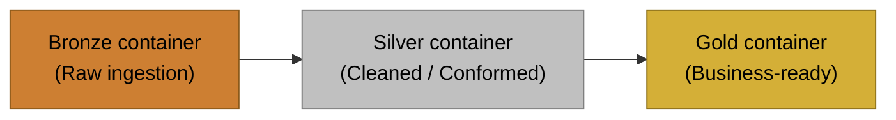

# Project Setup Guide

This project provisions Azure resources using Terraform and includes helper scripts.



## Prerequisites
- Azure CLI (az) installed and authenticated
- Terraform installed (>= 1.5)
- Python 3.10+ (for running the helper scripts)

## Azure CLI
Check your Azure CLI and login status:

```powershell
az --version
az login
az account show
```

If you need to switch subscriptions:

```powershell
az account list --output table
az account set --subscription "<subscription-id-or-name>"
az account show
```

## Terraform Setup
Check if Terraform is installed and on PATH:

```powershell
terraform version
```

Install or update Terraform on Windows:

```powershell
winget install HashiCorp.Terraform
```

```powershell
choco install terraform -y
```

After installing, re-open PowerShell and re-run terraform version.

## Project Structure
- `terraform/01_resource_group`: Azure resource group
- `terraform/02_storage_account`: ADLS Gen2 storage account + medallion containers
- `scripts/`: Helper scripts to deploy/destroy Terraform resources
- `guides/setup.md`: This guide
- `notebooks/`: Databricks notebooks (to be added)

## Configure Terraform
The deploy script writes `terraform/01_resource_group/terraform.tfvars` and `terraform/02_storage_account/terraform.tfvars` automatically.
If you want different defaults, edit `DEFAULTS` in `scripts/deploy.py` before running.

Example variables files:
- `terraform/01_resource_group/terraform.tfvars.example`
- `terraform/02_storage_account/terraform.tfvars.example`

## Resource Naming
Resource names are built from a prefix plus a random pet suffix.
Override them by setting the explicit name variables or changing the prefixes.

## Deploy Resources
From the repo root or scripts folder, run:

```powershell
python scripts\deploy.py
```

Optional flags:

```powershell
python scripts\deploy.py --rg-only
python scripts\deploy.py --storage-only
```

## Destroy Resources
To tear down resources:

```powershell
python scripts\destroy.py
```

Optional flags:

```powershell
python scripts\destroy.py --rg-only
python scripts\destroy.py --storage-only
```

## Notes
- Storage defaults to Standard performance, LRS, ADLS Gen2 (HNS enabled), and public network access.
- Terraform state and tfvars files are gitignored by default.
- The random suffix keeps resource names unique per deployment.
